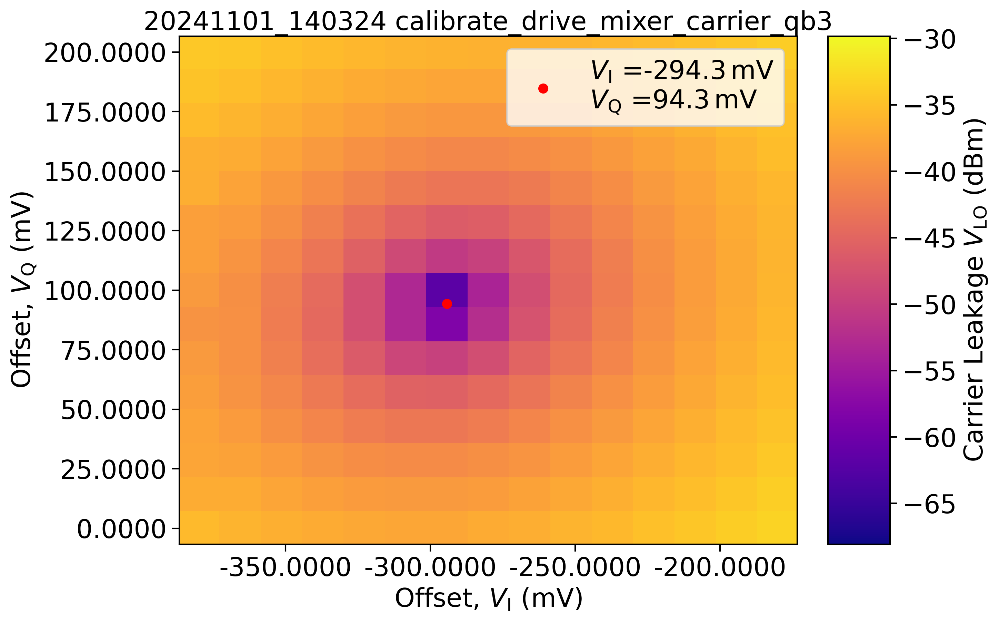
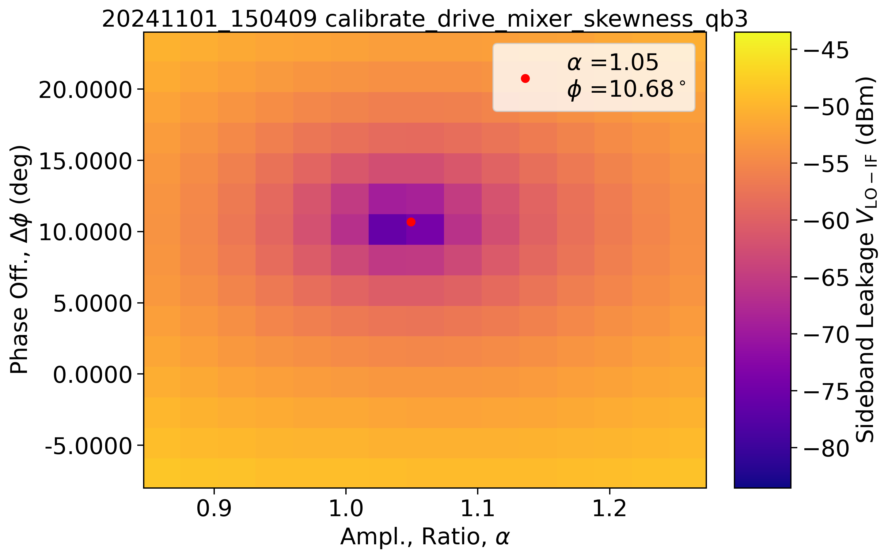

=================
Mixer Calibration
=================

----------
Background
----------

When using single sideband mixing, I and Q quadrature signals are multiplied with a local oscillator to (ideally) produce a single output sideband.
In reality, imperfections of the phase shifter and diodes used in the mixer mean that some of the local oscillator signal appears on the mixer output (carrier leakage) and the unwanted sideband may also appear (residual sideband).
To get rid of these signals which could unintentionally drive transitions in our qubits, we perform *mixer calibration*.

.. Note::
   These effects are frequency dependent, so you will need to recalibrate at each drive frequency you use.

Calibration has two aspects:

Carrier leakage suppression
^^^^^^^^^^^^^^^^^^^^^^^^^^^

Here we apply static voltage offsets to the I and Q intermediate-frequency inputs to bias the diodes and allow different amounts of the LO through each, improving the destructive cancellation.

.. Note::
   You may need to limit the voltage to avoid exceeding the maximum current of the diodes in the mixer (since this could damage them).

- According to ZI, an HDAWG cannot output a voltage offset which could damage an HDIQ.
- The precise signal level that you observe here depends on whether you bypass the cryostat using warm switches or measure through it.

Residual sideband suppression
^^^^^^^^^^^^^^^^^^^^^^^^^^^^^

Here we sweep an amplitude offset ratio (``ge_alpha``) between the I and Q quadrature signals and the phase difference between the signals (``ge_phi_skew``) (minus the ideal 90 degrees)

------------
Code example
------------
.. code-block:: python

    from pycqed.measurement.calibration import mixer as mxr

    limits_lo_i = (-0.1, 0.1)  # V
    limits_lo_q = (-0.1, 0.1)  # V
    limits_sb_alpha = (-0.1, 0.1)  # unitless, amplitude ratio
    limits_sb_phi_skew = (-15, 15)  # degrees
    n_meas_lo = 15
    n_meas_sb = 15

    for qb in [qb1]:
        mxr.MixerCarrier(
            qubit=qb.name,
            dev=dev,
            offset_i=qb.ge_I_offset() + np.linspace(
                *limits_lo_i,
                n_meas_lo,
            ),
            offset_q=qb.ge_Q_offset() + np.linspace(
                *limits_lo_q,
                n_meas_lo,
            ),
        )
        mxr.MixerSkewness(
            qubit=qb.name,
            dev=dev,
            alpha=qb.ge_alpha() + np.linspace(
                *limits_sb_alpha,
                n_meas_sb,
            ),
            phi_skew=qb.ge_phi_skew() + np.linspace(
                *limits_sb_phi_skew,
                n_meas_sb,
            ),
        )

---------------
Example results
---------------

Carrier leakage suppression

Residual sideband suppression

----
Tips
----

If the measured signal just looks like noise, you need to make sure that you are measuring at the correct frequency. Check:

- That your ``ge_mod_freq`` (intermediate frequency) is not too large for the bandwidth of your up-conversion mixer
- That any upconversion modules / warm switches are set to the correct position (an orange LED on an HDIQ channel indicates calibration mode)
- (*Rare*) That your local oscillator is producing the correct frequency
